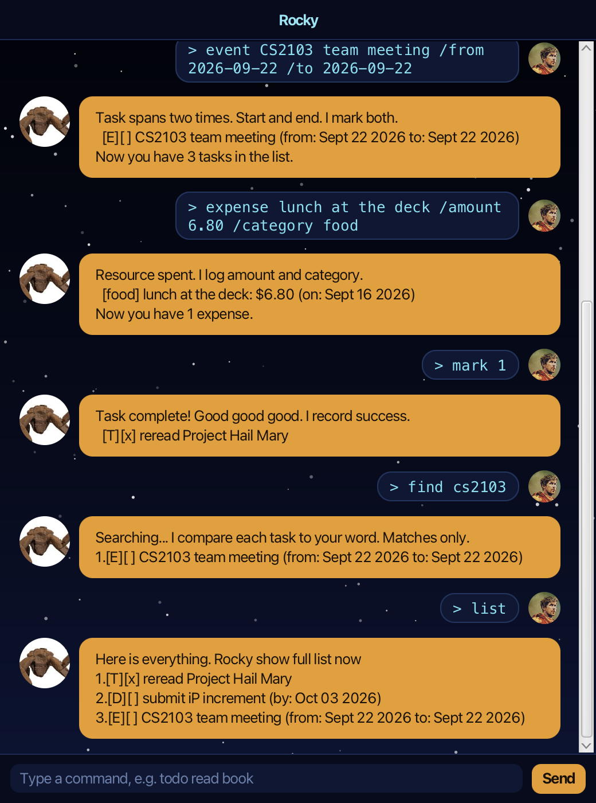

# Rocky

Inspired by Rocky from *Project Hail Mary*. The theme and chat replies are
inspired by this character. Rocky is an assistant that helps you manage your
tasks. You type plain-text commands into a chat window, and Rocky keeps track of
your to-dos, deadlines, events, and spending — saving everything to disk, so your
list is still there the next time you start him up.



## Setting up

1. Make sure you have **Java 25** installed. Check with `java -version`.
2. Download `rocky.jar` from the latest release.
3. Put it in an empty folder — Rocky creates his save files (`duke.txt` and
   `expenses.txt`) in a `data` folder beside the jar.
4. Open a terminal in that folder and run:

   ```
   java -jar rocky.jar
   ```

5. Type a command into the box at the bottom and press Enter (or click **Send**).
   Try `todo read book` to add your first task, then `list` to see it.

To build from source instead, clone the repository and run `./gradlew run`.

## Features

Dates are written in ISO format, `yyyy-mm-dd` (e.g. `2026-09-16`). An index like
`2` refers to a task's position in `list`, or an expense's position in `expenses`.

| Feature | Description | Command |
| --- | --- | --- |
| Add a to-do | Adds a task with no date attached. | `todo <description>`<br>e.g. `todo read book` |
| Add a deadline | Adds a task that has to be done by a given date. | `deadline <description> /by <yyyy-mm-dd>`<br>e.g. `deadline return book /by 2026-10-15` |
| Add an event | Adds a task that runs from a start date to an end date. | `event <description> /from <yyyy-mm-dd> /to <yyyy-mm-dd>`<br>e.g. `event conference /from 2026-10-02 /to 2026-10-03` |
| List tasks | Shows every task, numbered, with its done state. | `list` |
| Mark as done | Marks the task at the given index as done. | `mark <index>`<br>e.g. `mark 2` |
| Mark as not done | Undoes a mark, setting the task back to not done. | `unmark <index>`<br>e.g. `unmark 2` |
| Delete a task | Removes the task at the given index from the list. | `delete <index>`<br>e.g. `delete 2` |
| Find tasks | Lists the tasks whose description contains the keyword, ignoring case. | `find <keyword>`<br>e.g. `find book` |
| Record an expense | Logs an amount spent, under a category. The date is optional and defaults to today. | `expense <description> /amount <amount> /category <category> [/on <yyyy-mm-dd>]`<br>e.g. `expense lunch /amount 12.50 /category food` |
| List expenses | Shows every expense you have recorded, numbered. | `expenses` |
| Delete an expense | Removes the expense at the given index from the expense list. | `delete-expense <index>`<br>e.g. `delete-expense 1` |
| Exit | Says goodbye and closes the window a moment later. | `bye` |

If Rocky doesn't understand a command, he replies in a red alert card explaining
what was wrong — nothing is added or changed when that happens.

## Saving your data

Rocky saves after every change, so there is no save command. Tasks go to
`data/duke.txt` and expenses to `data/expenses.txt`, both plain text files you
can read. If a line in a save file is damaged, Rocky skips that line and loads
the rest, rather than refusing to start.
